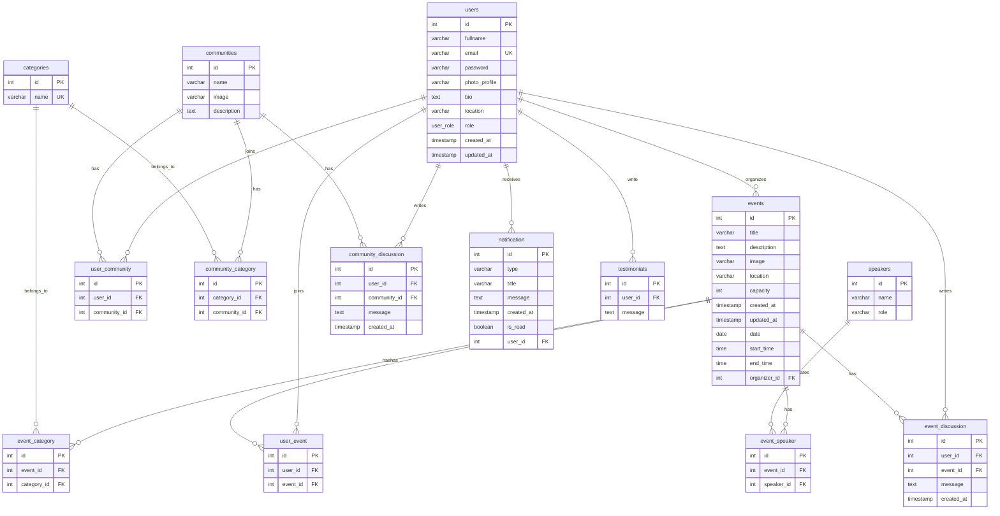
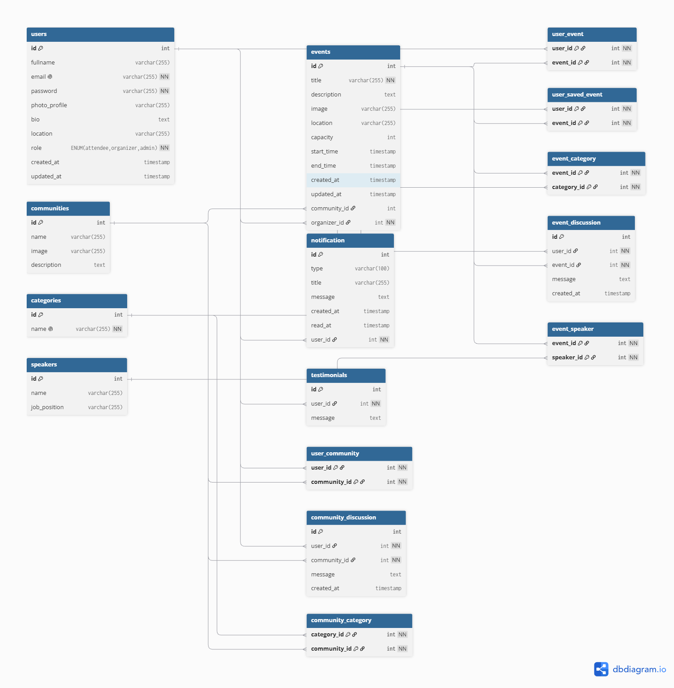

```mermaid
erDiagram

    users {
        int id PK
        varchar fullname
        varchar email UK
        varchar password
        varchar photo_profile
        text bio
        varchar location
        user_role role
        timestamp created_at
        timestamp updated_at
    }

    events {
        int id PK
        varchar title
        text description
        varchar image
        varchar location
        int capacity
        timestamp created_at
        timestamp updated_at
        date date
        time start_time
        time end_time
        int organizer_id FK
    }

    user_event {
        int id PK
        int user_id FK
        int event_id FK
    }

    communities {
        int id PK
        varchar name
        varchar image
        text description
    }

    user_community {
        int id PK
        int user_id FK
        int community_id FK
    }

    categories {
        int id PK
        varchar name UK
    }

    event_category {
        int id PK
        int event_id FK
        int category_id FK
    }

    community_category {
        int id PK
        int category_id FK
        int community_id FK
    }

    event_discussion {
        int id PK
        int user_id FK
        int event_id FK
        text message
        timestamp created_at
    }

    speakers {
        int id PK
        varchar name
        varchar role
    }

    event_speaker {
        int id PK
        int event_id FK
        int speaker_id FK
    }

    community_discussion {
        int id PK
        int user_id FK
        int community_id FK
        text message
        timestamp created_at
    }

    notification {
        int id PK
        varchar type
        varchar title
        text message
        timestamp created_at
        boolean is_read
        int user_id FK
    }

    testimonials {
        int id PK
        int user_id FK
        text message
    }

    users ||--o{ user_event : joins
    events ||--o{ user_event : has

    users ||--o{ user_community : joins
    communities ||--o{ user_community : has

    users ||--o{ events : organizes

    events ||--o{ event_category : has
    categories ||--o{ event_category : belongs_to

    communities ||--o{ community_category : has
    categories ||--o{ community_category : belongs_to

    users ||--o{ event_discussion : writes
    events ||--o{ event_discussion : has

    events ||--o{ event_speaker : has
    speakers ||--o{ event_speaker : participates

    users ||--o{ community_discussion : writes
    communities ||--o{ community_discussion : has

    users ||--o{ notification : receives

    users ||--o{ testimonials : write

```
https://dbdiagram.io/d/eventhub-6aaf9f986d586d617e78b92d

alt